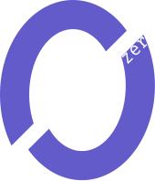
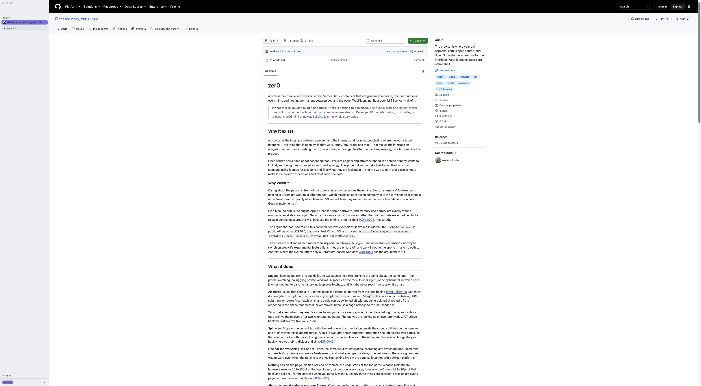
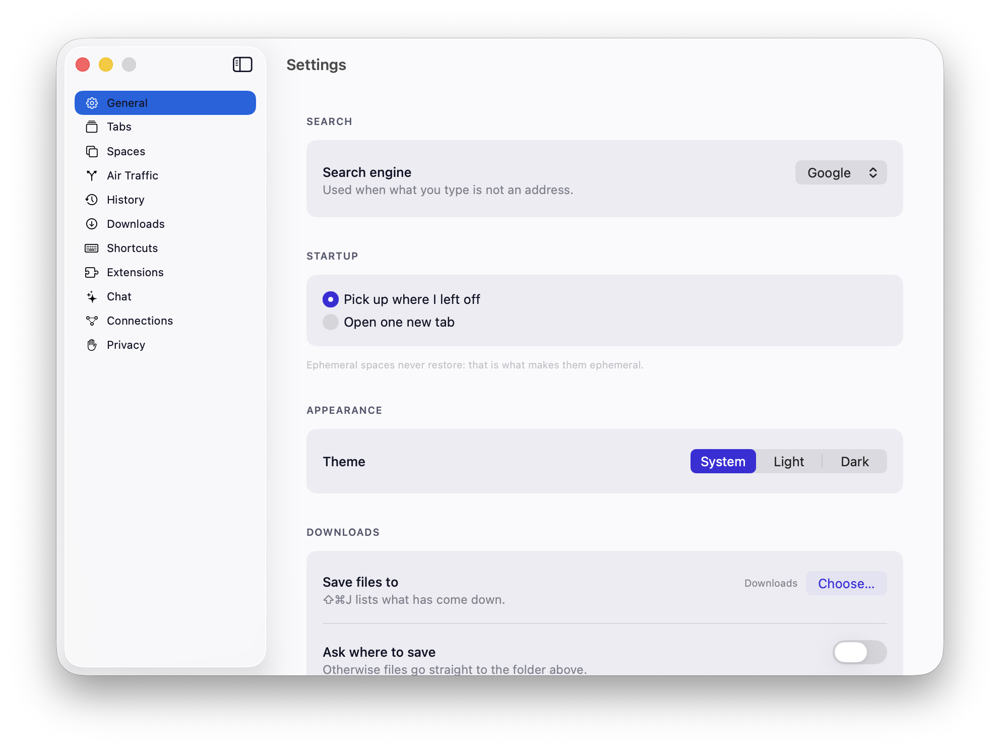
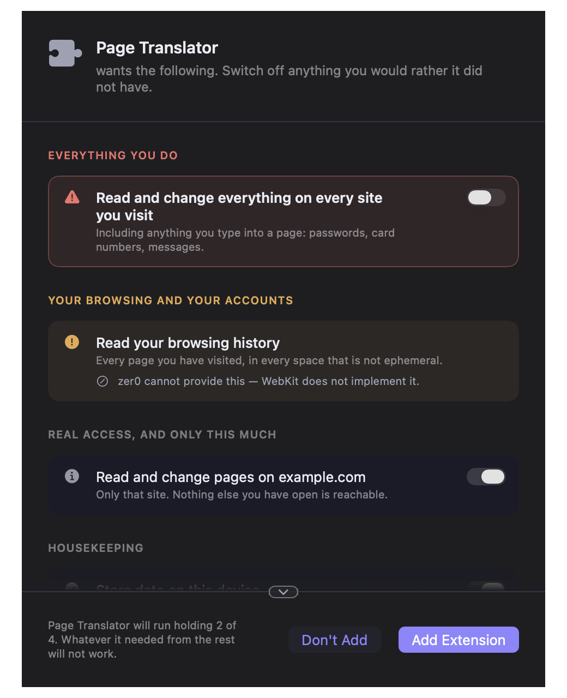

<p align="center"></p>

# zer0

A browser for people who live inside one. Vertical tabs, containers that are
genuinely separate, one bar that does everything, nothing permanent between you
and the page. WebKit engine, Rust core, native Swift shell, MIT.

## Why

The browser is where a person's working day happens — and open source keeps
treating that surface as something to get to later, on the theory that the
engine is the hard part and the chrome can be a settings dialog with eleven
tabs. zer0 does not take that trade: here, the interface *is* the product.

It started with [firefox-airtraffic](https://github.com/avelino/firefox-airtraffic),
an extension built because one specific thing was missing — and solving that
one thing left the rest of the list exactly where it was. zer0 is the rest of
the list. The full argument, decision by decision with what each one cost, is
in **[Taste is not a method](https://avelino.run/taste-is-not-a-method/)**.



| Settings | Extension consent |
|---|---|
|  |  |

## What it does

- **Spaces** — each space owns its cookie jar: two logins to the same site at
  once. An ephemeral space writes nothing to disk, ever.
- **Air traffic** — rules that send each URL to the space it belongs to.
- **Tabs** — favorites follow you everywhere, pins stay put, today's tabs
  archive themselves after twelve untouched hours.
- **Split view** — ⌘\ pairs two tabs side by side; ⇧⌘\ moves the keyboard.
- **One bar** — ⌘T and ⌘L are the same input for navigating, searching and
  switching tabs. The ranking lives in the core.
- **Nothing on the page** — no title bar, no toolbar: 38–90pt given back on
  every window, forever.
- **The keymap you already have** — Chrome-compatible, one binding per
  shortcut, stored are only your changes.
- **Downloads that do not lie** — no invented progress bars, no silent
  overwrites, honest names for interrupted files.
- **Site icons without the tell** — fetched anonymously, cached per space.
- **Chrome extensions** — paste a store link; every permission explained in
  plain language before anything runs, worst first.
- **An assistant** — ⌘E opens a conversation about the page you are on. Bring
  your own key (Anthropic, OpenAI, Gemini, or local Ollama); no tool runs
  until somebody approves that exact tool.

## Build and run

Rust and Xcode, macOS 15.4 or newer.

```sh
./scripts/build.sh              # debug build → apple/.build/Zer0.app
./scripts/build.sh release      # optimised
open apple/.build/Zer0.app
```

`./scripts/check.sh` is the gate — fmt, clippy, the Rust suite, the decision
record, the Swift suite. Green is the definition of done.

## Where this is

Development. You can build it and run it; **there is nothing to download**.
The bundle is ad-hoc signed (runs on the machine that built it, Gatekeeper
refuses a copy), no notarisation, no release yet. Not every Chrome extension
will work — `chrome.debugger` in particular is declined by policy, not missed
by the engine.

## Going deeper

| | |
|---|---|
| [`docs/adr/`](docs/adr/) | One file per decision — why the code is this way, what it cost, and the test that goes red if it is undone. Start here. |
| [`DESIGN.md`](DESIGN.md) | The design system: every token, with the criterion for reaching for it. |
| [`CONTRIBUTING.md`](CONTRIBUTING.md) | Build steps, generated bindings, and how a decision gets recorded. |
| [`docs/webkit.md`](docs/webkit.md) | Running against a newer WebKit, embedding one, and the signing consequences. |
| [`docs/licensing.md`](docs/licensing.md) | The dependency audit and the LGPL compliance checklist. Read before a release, not after. |

## Licence

MIT for the code in this repository — see [`LICENSE`](LICENSE). WebKit is
LGPL-2.1-or-later; a build that embeds it inherits obligations MIT does not
describe, mapped in [`docs/licensing.md`](docs/licensing.md).
