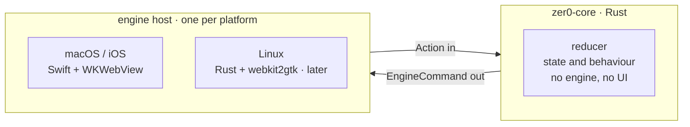

# zer0

A browser for people who live inside one. Vertical tabs, containers that are
genuinely separate, one bar that does everything, and nothing permanent between
you and the page. WebKit engine, Rust core, MIT licence — all of it.

> **Where this is: you can build it and run it. There is nothing to download.**
> The bundle is ad-hoc signed, which means it runs on the machine that built it
> and nowhere else. No Developer ID, no notarisation, no installer, no release.
> macOS 15.4 or newer. [Building it](#build-and-run) is the whole story today.

---

## Why it exists

A browser is the interface between a person and the internet, and for most
people it is where the working day happens — the thing that is open while they
work, study, buy, argue and think. That makes the interface an obligation
rather than a finishing touch. It is not the part you get to after the hard
engineering; on a browser it *is* the product.

Open source has a habit of not accepting that. Excellent engineering arrives
wrapped in a screen nobody wants to look at, and being free is treated as
sufficient apology. This project does not take that trade. The bar is that
someone using it stops for a second and likes what they are looking at — and
the way to earn that claim is not to make it. [Below](#design-as-decisions-rather-than-adjectives)
are six decisions and what each one cost.

### Why WebKit

Caring about the person in front of the browser is also what settles the
engine. Every "alternative" browser worth naming is Chromium wearing a
different coat, which means an advertising company sets the terms for all of
them at once. Vivaldi said so plainly when Manifest V3 landed: how they would
handle the restriction "depends on how Google implements it".

On a Mac, WebKit is the engine Apple tunes for Apple hardware, and memory and
battery are exactly what a window open all day costs you. Security fixes arrive
with OS updates rather than with our release schedule. And a release bundle
measures **7.4 MB**, because the engine is not inside it
([ADR-0004](docs/adr/0004-the-mvp-uses-the-system-webkit.md), measured).

The argument that used to end this conversation was extensions. It expired in
March 2025: `WKWebExtension` is public API as of macOS 15.4, loads Manifest V2
and V3, and covers `declarativeNetRequest`, `webRequest`, `scripting`, `tabs`,
`cookies`, `storage` and `nativeMessaging`.

The costs are real and named rather than skipped: no `chrome.debugger` and no
devtools extensions, no way to switch on WebKit's experimental feature flags
(they are private API and we will not tie the app to it), and no path to
Android, where the system offers only a Chromium-based WebView.
[ADR-0001](docs/adr/0001-webkit-as-the-engine-not-chromium.md) has the argument
in full.

---

## What it does

**Spaces.** Each space owns its cookie jar, so two spaces hold two logins to the
same site at the same time — no profile switching, no juggling private windows.
A space can override its user agent, or be ephemeral, in which case it writes
nothing to disk: no history, no icon ever fetched, and its tabs never reach the
session file at all.

**Air traffic.** Rules that send a URL to the space it belongs to, ported from
the idea behind [firefox-airtraffic](https://github.com/avelino/firefox-airtraffic).
Match by domain (strict, so `github.com` catches `gist.github.com` and never
`fakegithub.com`), domain substring, URL substring, or regex; first match wins,
and a rule can be switched off without being deleted. A routed URL is *reopened*
in the space that owns it, never moved, because a page belongs to the jar it
loaded in.

**Tabs that know what they are.** Favorites follow you across every space,
pinned tabs belong to one, and today's tabs archive themselves after twelve
untouched hours. The tab you are looking at is never archived. ⇧⌘T brings back
the last twenty-five you closed.

**Split view.** ⌘\ pairs the current tab with the next one — documentation
beside the code, a diff beside the issue — and ⇧⌘\ moves the keyboard across. A
split is two *tabs* shown together rather than one tab holding two pages, so the
sidebar marks both rows, closing one side hands the whole area to the other, and
the session brings the pair back where you left it, divider and all.
([ADR-0042](docs/adr/0042-a-split-is-two-tabs-shown-together-not-one-tab-with-two-pages.md).)

**One bar for everything.** ⌘T and ⌘L open the same input for navigating,
searching and switching tabs. Open tabs outrank history, history outranks a
fresh search, and what you typed is always the last row, so there is a
guaranteed way forward even when the ranking is wrong. The ranking lives in the
core, so it cannot drift between platforms.

**Nothing sits on the page.** No title bar and no toolbar: the page starts at
the top of the window. Mainstream browsers reserve 60 to 100pt at the top of
every window, on every page, forever — zer0 gives 38 to 90pt of that back and
asks ⌘L for the address when you actually want it. Exactly three things are
allowed to take space over a page, and each one is conditional
([ADR-0010](docs/adr/0010-nothing-sits-on-the-page-permanently.md)).

**Shortcuts you already have in your fingers.** One keymap, in the core, written
against a `primary` modifier that resolves to Command on Apple and Control
elsewhere — so ⌘T and Ctrl+T are one binding rather than two that must be kept
in step. Menus are built from the keymap, so rebinding a shortcut updates the
menu with it. Only your changes are stored, which means a later change to the
shipped defaults still reaches anyone who never rebound anything.

**Downloads that do not lie.** A second `report.pdf` becomes `report-2.pdf`
rather than an overwrite. A download the server gave no length for gets a
spinner, not a progress bar sitting at an invented fill. One killed by quitting
comes back as *interrupted* rather than *failed*, and says so in those words,
because nothing went wrong with the transfer — we did. The list shows only files
that are still on disk.

**Site icons, without the tell.** Icons are fetched anonymously, outside every
cookie jar, and cached per space — so a site cannot learn you visited it in
another space by noticing you never asked for its icon. Where there is no icon,
a tile coloured by a hash of the hostname stands in, which means the same site
gets the same colour in every window and every session, forever.

**Chrome extensions.** Install by pasting a store link; the package is unpacked
from CRX and loaded through `WKWebExtension`. Before anything runs, a sheet says
in plain language what each permission costs, ranked worst first. Anything the
browser cannot explain arrives unticked and is never granted quietly, and a
refusal is recorded, so an extension that grows a permission later has to ask
again.

**An assistant — being built, and not usable yet.** Be clear about this one.
Settings can already configure a provider (Anthropic, OpenAI, Gemini, or a local
Ollama), keep the key in the Keychain, validate it, list its models, and
register MCP connections. The core holds conversations scoped to a tab or a
space, streams replies, and will not run any tool until somebody has approved
that exact tool. What does not exist is the panel: nothing in the window draws a
conversation, and the app installs a host that answers every request with "no
provider configured". ⌘E and the command bar's Ask row create a conversation you
cannot see. Do not install this expecting to talk to a model.

---

## Design, as decisions rather than adjectives

**The mark is redrawn below 32 pixels, not scaled down.** At small sizes the cut
in the zero closes under antialiasing and what is left is a plain O, so
`zer0-small.svg` is a different drawing: the ring goes 32u → 44u, the gap and
slip roughly double, and the mark is *shortened* — 80×104 to 72×94 — because the
grid scales by its tallest dimension and height given up buys thickness
everywhere else. The threshold is in rendered pixels, not points, so 16pt@2x
gets the small drawing and 32pt@2x gets the canonical one. *"This is what type
designers call hinting, and refusing to do it is how a mark ends up as a smudge
in the Dock"* ([ADR-0040](docs/adr/0040-the-mark-is-a-cut-zero-drawn-as-geometry.md)).

**The find bar will not tell you "3 of 17".** `WKFindResult` reports whether
there was a hit and nothing else, so the bar has five states that each map to a
fact — idle, pending, searching, found, not found — and invents no number to
fill the space. Two of those states exist only so it does not lie by omission: a
spinner while WebKit answers, and a `pending` guard so a stale "No matches" never
sits beside freshly typed text. The ADR does not pretend this is free: *"the
find bar is objectively less informative than any competitor's… this is the
direct cost and there is no consolation for it"*, and it names its own
temptation — *"adding '3 of 17' is a change everybody praises in the PR. No test
goes red, the screen looks more like Chrome, and the number is wrong on any page
with an iframe"*
([ADR-0018](docs/adr/0018-we-say-only-what-we-can-prove.md)).

**A failed page gets the whole screen, and says what happened.** *"A white
rectangle is the worst possible answer to 'did that work?'. It is
indistinguishable from three different things: a page still loading, a page that
failed, and a page that is genuinely empty."* Eight failure kinds, each with its
own icon, a title named for what happened rather than for the error that
reported it, a sentence you can act on, and the full address underneath — with
Return on the retry. The platform's own answer was `NSURLErrorDomain -1009`, and
*"nobody in history has ever been helped by reading that"*
([ADR-0016](docs/adr/0016-a-failed-page-gets-the-whole-screen.md)).

**The chrome takes its colour from the page, so there is no seam.** The strip
above the page wears the site's own `theme-color`, falling back through the
document background to what the engine actually painted, and to nothing at all
when there is honestly no answer. A colour that cannot carry legible controls is
moved along lightness only — hue and saturation untouched — until it clears 6:1
against the ink, so pure red comes out `#ff3e3e` and is still plainly red. The
page is sampled exactly twice per navigation, at commit and at load end, never
on a timer, so an animated `theme-color` cannot strobe the window. The sidebar
deliberately does *not* take the tint: *"a sidebar row does not touch the page it
names, so the same colour there is not continuity — it is decoration"*
([ADR-0047](docs/adr/0047-the-chrome-takes-its-colour-from-the-page-and-the-core-decides-what-that-colour-is.md)).

**Reduce Motion takes away travel and overshoot, never feedback.** A panel still
arrives, over the same 180ms; it stops bouncing. A transition loses its edge and
keeps its fade. A press keeps its dimming and loses its 3% squeeze — because
someone who asked for less movement did not ask for a less responsive interface.
The rule is enforced by making the raw curves unreachable: there are exactly
three ways to spell motion in the shell and all three read the accessibility
setting on the way through. *"A curve written out at a call site no longer
compiles. That is the point: this decision cannot be forgotten by omission, only
reverted on purpose"*
([ADR-0046](docs/adr/0046-reduce-motion-takes-away-travel-and-overshoot-never-feedback.md)).

**An empty state is a product screen, not an apology.** Nobody sees the full
list on day one, so every empty pane in the browser offers the next step rather
than reporting a count of zero — and two of them hand it over directly:
Extensions opens the store for someone who has no extension to link to yet, and
Air Traffic's "Start with an example" *writes the first rule into the composer*,
because somebody with no rules does not know the shape of one. The only pane
with no action is History, where there is genuinely nothing to offer but
browsing.

None of that is a style guide someone has to remember. Each is an ADR in
[`docs/adr/`](docs/adr/), and every ADR names the test that goes red if the
decision is undone. `./scripts/adr-check.sh` resolves every one of them on every
run — the file must exist and the test name must really be in it — and the
decisions that cannot be locked print as a debt count, because a number you see
every day gets paid down and a number behind a flag does not. The palette was
chosen the same way: three complete proposals rendered side by side and judged
by looking, which is how it was found that the most-looked-at surface in the
product was taking its colour from the macOS system accent and no proposal could
reach it.

[`DESIGN.md`](DESIGN.md) is the full system — every token, with the criterion
that says when to reach for it.

---

## Build and run

Rust and Xcode, on macOS 15.4 or newer.

```sh
./scripts/build.sh              # debug build → apple/.build/Zer0.app
./scripts/build.sh release      # optimised
open apple/.build/Zer0.app
```

`ZER0_OPEN_URL=https://example.com apple/.build/Zer0.app/Contents/MacOS/Zer0`
launches straight into a page.

**That app runs on the machine that built it and nowhere else.** `bundle.sh`
signs ad-hoc, deliberately without the hardened runtime. There is no Developer
ID certificate, no notarisation and no release, so copying the bundle to another
Mac is not a supported thing to do — Gatekeeper will refuse it, and it should.
The reasoning behind leaving the hardened runtime off, and what would have to
change to ship, is in [`docs/webkit.md`](docs/webkit.md).

[`CONTRIBUTING.md`](CONTRIBUTING.md) covers the individual build steps, the
generated bindings, and `./scripts/check.sh` — the gate that has to be green
before anything is done.

---

## How it is built



The core decides everything and does not know what a `WKWebView` is. The shell
renders, hosts web views, and decides nothing. That split is what lets the
browser's behaviour be tested without opening a window, and what will make the
Linux port a new host rather than a rewrite. CI already builds and tests the
core on Linux, well before a Linux shell exists, so it cannot quietly grow Apple
assumptions.

The same command stream drives both sides: the engine host builds and tears down
web views from it, and the extension host uses it to keep `chrome.tabs` in step
with reality.

The corollary decides where a UX change goes. *Behaviour* belongs to the core —
command-bar ranking, the keymap, tab lifecycle, routing, what a downloaded file
is named, whether a progress bar can fill at all. *Appearance* stays in the shell
— colour, spacing, animation, label copy. If two platforms could reasonably
disagree about something, that something is in the wrong place.
[`CLAUDE.md`](CLAUDE.md) states the rule; [`DESIGN.md`](DESIGN.md) §1 has the
ambiguous cases already resolved, each against the obvious reading.

---

## Known limits

**There is no release.** Ad-hoc signing runs on the machine that built it, full
stop. See [Build and run](#build-and-run).

**The assistant is not connected.** Providers and MCP connections are
configurable and the conversation engine is written and tested, but no panel
draws a conversation and the app ships a host that refuses every request. See
[What it does](#what-it-does).

**Not every extension will work.** `WKWebExtension` implements a large part of
the API surface, not all of it. Blockers and utilities should be fine; anything
leaning on `chrome.debugger` or devtools APIs will not be.

**Package signatures are not verified yet.** The CRX parser checks that a
package's declared ID matches the ID derived from its signing key, which stops a
swapped response from installing something else under the ID you asked for. The
RSA and ECDSA signatures themselves are not checked. Until they are, the
authenticity guarantee is HTTPS plus that ID check.

**Fetching from the Chrome Web Store is not a supported use.** The update
endpoint is not a documented public API and the store's terms do not grant
third-party clients access to it. It is isolated behind a single function so
that moving to another source is a new implementation, not a refactor.

**The bundled SQLite is built for the installed SDK, not the deployment
target.** The `cc` crate derives its own `-target` and ignores both
`MACOSX_DEPLOYMENT_TARGET` and `CFLAGS`, so `sqlite3.o` claims a minimum macOS
of whatever SDK is on the build machine and the linker says so. It runs fine
where it was built. Before shipping to an older macOS than the build machine,
this needs solving.

**macOS is the only shell.** The core is engine-agnostic by construction and
Linux is the intended second host, but that host does not exist yet.

**Android has no path.** No maintained WebKit port exists for it; the system
offers only a Chromium-based WebView. The realistic targets are macOS, iOS,
iPadOS, Linux and Windows.

---

## Going deeper

| | |
|---|---|
| [`CLAUDE.md`](CLAUDE.md) | What the project believes and what "done" means. Read this first. |
| [`DESIGN.md`](DESIGN.md) | The design system: every token, with the criterion for reaching for it. |
| [`docs/adr/`](docs/adr/) | One file per decision — why the code is this way and not the other way. |
| [`CONTRIBUTING.md`](CONTRIBUTING.md) | Build, verify, layout, and how a decision gets recorded. |
| [`docs/webkit.md`](docs/webkit.md) | Running against a newer WebKit, embedding one in the bundle, and the code-signing consequences. |
| [`docs/licensing.md`](docs/licensing.md) | The dependency audit and the compliance checklist. |

---

## Licence

MIT, for the code in this repository. See [`LICENSE`](LICENSE).

That is not the whole story, because the engine is not ours. WebKit is
LGPL-2.1-or-later, and a build that embeds it inherits obligations MIT does not
describe — shipping the engine's source at the pinned tag, and letting someone
replace the embedded frameworks with their own build.
[`docs/licensing.md`](docs/licensing.md) has the audit, the per-dependency
table, and the compliance checklist. Read it before cutting a release, not
after.
